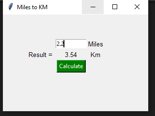

# Miles to Kilometers Converter

## Description

This is a simple Python GUI application built using the Tkinter library. The program allows the user to enter a distance in miles and instantly converts it to kilometers when the **Calculate** button is clicked.

The project was created to practice the basics of Tkinter, including creating windows, labels, buttons, entry widgets, using the grid layout manager, and handling button events.

## Features

- Accepts distance in miles as user input.
- Converts miles to kilometers using the conversion factor:
  - 1 Mile = 1.60934 Kilometers
- Displays the result rounded to two decimal places.

## Output

