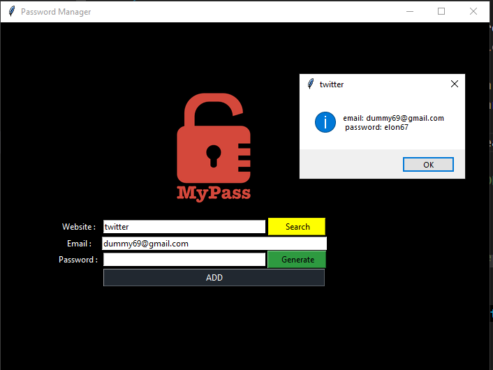

# Password Manager

A simple desktop password manager built with Python and Tkinter. It generates strong passwords, saves website credentials locally, and lets you search for saved credentials by website name.

## Features

- **Password Generator**: Creates a random strong password and automatically copies it to the clipboard (via `pyperclip`), so you can paste it directly wherever needed.
- **Save Credentials**: Saves website, email, and password entries to a local `password.json` file. If the file doesn't exist yet, it creates one.
- **Search**: Look up a saved website and instantly view its stored email and password in a popup.
- **Default Email**: The email field pre-fills with a default email so you don't have to retype it every time.
- **Input Validation**: Shows an error popup if the website or password field is left empty when saving.

## How It Works

- `main.py` — builds the Tkinter GUI (window, labels, entry fields, buttons) and handles saving/searching logic.
- `password_gen.py` — generates the random password.
- `password.json` — local data file storing credentials as JSON, keyed by website name.

## Tech Used

- Python
- Tkinter (GUI)
- `json` (local data storage)
- `pyperclip` (clipboard access)

## Output

