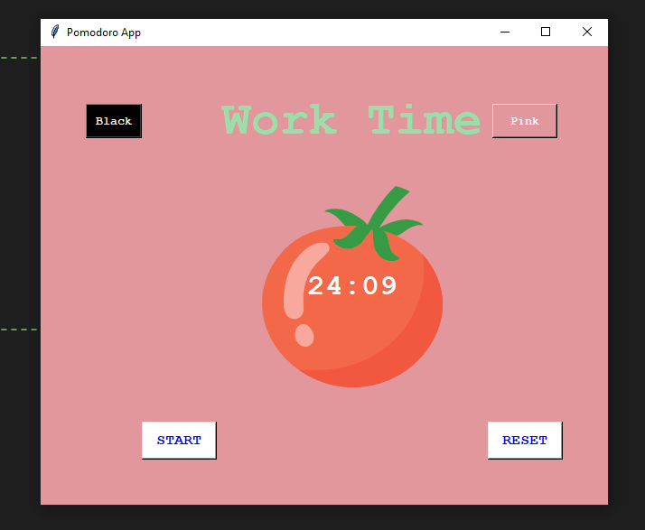
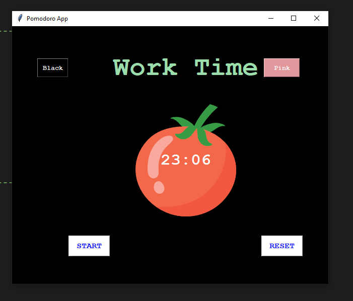

# 🍅 Pomodoro Timer

A simple and modern **Pomodoro Timer** built with **Python** and **Tkinter**. This application helps improve productivity using the Pomodoro Technique by providing focused work sessions with a clean graphical interface.

## Features

- ⏱️ 25-minute work timer
- 🍅 Custom tomato-themed interface
- 🎨 Light and Dark mode switching
- ▶️ Start timer
- 🔄 Reset timer
- 🖼️ Custom canvas graphics using Tkinter

## Technologies Used

- Python 3
- Tkinter
- Canvas Widget
- Tkinter Buttons
- Tkinter `after()` method
- PhotoImage

---

# Screenshots

## Light Theme

---

## Dark Theme

---