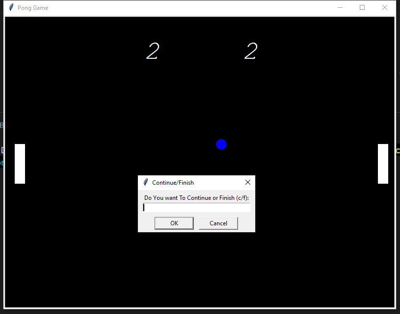

# Pong Game

A simple two-player Pong game built in Python using the built-in `turtle` module. This project was created to practice object-oriented programming, collision detection, keyboard event handling.
## Features

- Two-player gameplay
- Ball bounces off walls and paddles
- Score tracking for both players
- Ball speed increases after each paddle hit
- Simple quit option during gameplay with the key q

## Controls

### Left Player
- **W** - Move Up
- **S** - Move Down

### Right Player
- **Up Arrow** - Move Up
- **Down Arrow** - Move Down

### Other
- **Q** - Quit the game

# Output
