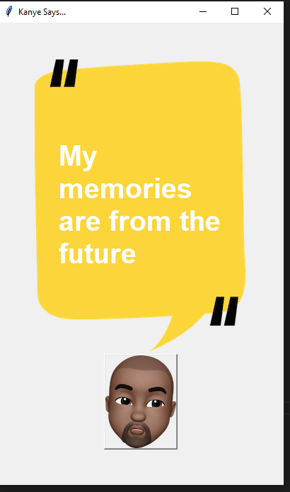

# Kanye Quotes API
 
A simple desktop GUI app built with Tkinter that fetches random Kanye West quotes from the [Kanye REST API](https://api.kanye.rest) and displays them on screen.
 
## How it works
 
- The app opens a window with a background image and a "Kanye" button.
- Clicking the button sends a GET request to `https://api.kanye.rest`.
- The API returns a JSON response containing a `quote` field.
- The quote text is extracted and displayed on the canvas.
## Requirements
 
- Python 3
- `requests` library (`pip install requests`)
- Tkinter (comes bundled with most Python installs)

## Notes
 
- No API key is required — `api.kanye.rest` is a free, public API.
- `CURR_DIR` is used to build file paths relative to the script's location, so the app works regardless of which directory it's run from.

## Output
 
