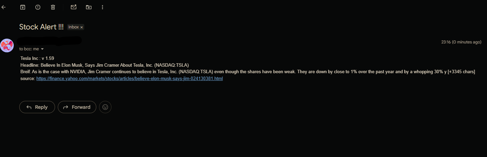

# Stock News Alert Bot

Checks TSLA's daily closing price. If it moved more than 5% from the previous day, it fetches a related news headline and emails you an alert.



## How it works

1. Gets yesterday's and the day-before's closing price from Alpha Vantage (a stock market data API).
2. Calculates the percentage change.
3. If the change is greater than 1%, it pulls the top news article about the company from NewsAPI.
4. Sends you an email via Gmail's SMTP server (SMTP = Simple Mail Transfer Protocol, the protocol used to send email) with the price change and headline.

## Setup

**1. Install dependencies:**
```bash
pip install requests_cache python-dotenv
```

**2. Create a `.env` file** in the same folder as the script:
```
my_email=your_email@gmail.com
APP_PASSWORD=your_gmail_app_password
```
`APP_PASSWORD` is a Gmail **App Password** — a 16-character code you generate in your Google Account (Security → 2-Step Verification → App Passwords). It's used instead of your real password so the script can log into SMTP.


## Running it

```bash
python main.py
```

## Automating with Task Scheduler (Windows)

Task Scheduler runs a program automatically on a schedule, without you opening it manually.

1. Open **Task Scheduler** → **Create Task**.
2. **General tab**: name it (e.g. "Stock Alert"), select "Run whether user is logged on or not."
3. **Triggers tab** → **New** → set it to run **Daily**, after market close (e.g. 6:00 PM local time). Note: markets are closed on weekends/holidays, so the script will just reuse the last available trading data on those days.
4. **Actions tab** → **New**:
   - Program/script: path to your Python executable, e.g. `C:\Python312\python.exe`
   - Add arguments: full path to `main.py`, e.g. `C:\Users\you\project\main.py`
   - Start in: the folder containing `main.py` (so it can find `.env`)
5. **Conditions/Settings tabs**: uncheck "Start the task only if the computer is on AC power" if this is a laptop.
6. Save. Test it by right-clicking the task → **Run**.

