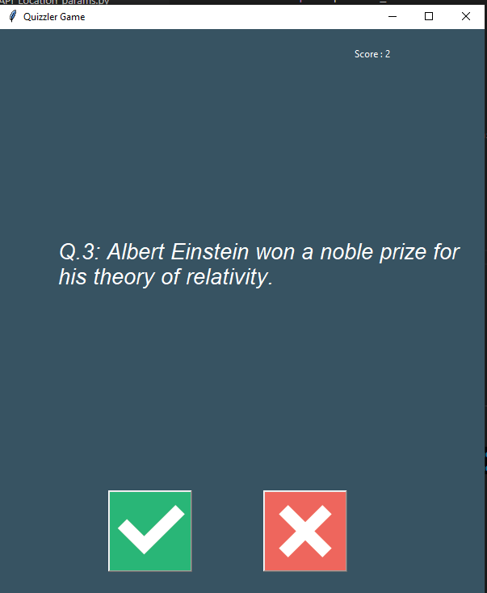
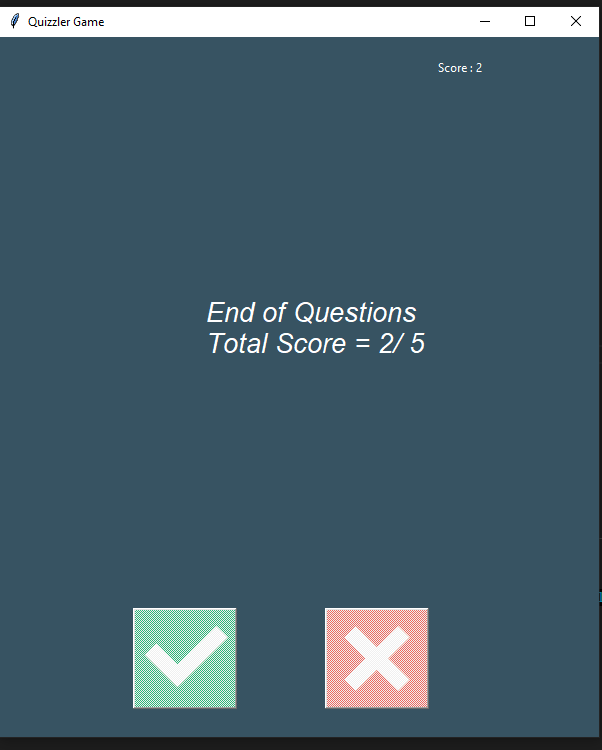

# Quizzler

A desktop quiz application built with Python and Tkinter. Questions are pulled live from the Open Trivia Database (OTDB) API based, and the app tracks the score as you answer.

## Features

- **Live questions**: Questions are fetched from the [Open Trivia DB API](https://opentdb.com/) at runtime, filtered by the category you choose (sent as a parameter in the API request).
- **Score tracking**: Your score updates and is stored as you go through the quiz.
- **Visual feedback**: The Tkinter canvas changes color to give instant feedback on your answer:
  - **Green** — correct answer
  - **Red** — wrong answer
- **Object-Oriented design**: The whole project is structured using OOP principles (separate classes for the quiz logic, the questions, and the GUI) rather than one long script.

## How It Works

1. On startup, the app sends a request to the Open Trivia DB API, including the selected category as a parameter.
2. The API response (a list of trivia questions) is used to build `Question` objects.
3. A `QuizBrain` class keeps track of the current question, checks answers, and holds the running score.
4. A `QuizInterface` class (built with Tkinter) displays each question on a canvas, and handles the tick/cross button clicks.
5. When you answer:
   - The canvas flashes **green** for a correct answer, **red** for an incorrect one.
   - The score updates and the next question loads automatically.
6. The quiz ends once all questions have been answered, and your final score is displayed.


## Technologies Used

- **Python 3** — core language
- **Tkinter** — GUI and canvas-based visual feedback
- **Open Trivia DB API** — source of quiz questions
- **requests** library — for making the API calls
- **Object-Oriented Programming (OOP)** — used throughout the project structure


## Running the App

```
python main.py
```

## Output

Below are sample screenshots of the app in action:

| Question Screen | Feedback Screen |
|---|---|
|  |  |


